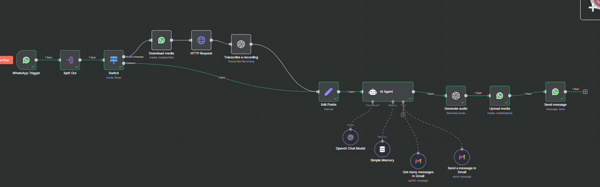

# 🤖 Agent IA WhatsApp pour la gestion intelligente des Emails Gmail avec n8n

## 📌 Présentation du projet

Ce projet tire parti de **n8n**, **OpenAI**, **WhatsApp Cloud API** et **Gmail API** pour construire un agent intelligent capable de :

- Réceptionner des messages vocaux via WhatsApp
- Transcrire automatiquement les audios en texte (OpenAI Whisper)
- Interpréter la demande avec un **agent IA personnalisé**
- Lire, filtrer ou envoyer des emails Gmail selon l’intention détectée
- Répondre à l’utilisateur par un message audio généré automatiquement

Le tout, de manière automatisée et contextualisée grâce à une mémoire courte intégrée dans l’agent IA.

---

## 🧠 Fonctionnalités principales

- 🎤 **Traitement des messages vocaux** reçus sur WhatsApp
- 📝 **Transcription automatique** (via OpenAI)
- 🤖 **Compréhension intelligente** de la demande grâce à un Agent Langchain/OpenAI
- 📧 **Connexion à Gmail** : lecture, envoi, réponse ou suppression d'emails
- 🔁 **Réponse audio générée automatiquement** (texte → audio)
- 🔒 Respect strict des règles de confidentialité et confirmation avant action

---

## 🛠️ Technologies utilisées

| Outil/Service        | Rôle principal                                     |
|----------------------|----------------------------------------------------|
| `n8n`                | Orchestration des workflows low-code               |
| `OpenAI` (GPT + TTS) | Compréhension, transcription et génération vocale  |
| `WhatsApp Cloud API` | Réception/envoi de messages WhatsApp               |
| `Gmail API`          | Opérations sur les emails                          |
| `LangChain`          | Gestion d’un agent IA structuré avec mémoire       |

---

## 🗂️ Architecture du workflow

1. **WhatsApp Trigger** : Déclenché à la réception d’un message
2. **Split + Switch** : Séparation et filtrage des messages vocaux
3. **Téléchargement et transcription de l’audio**
4. **Interprétation par un agent IA (prompt personnalisé)**
5. **Lecture ou gestion des emails via Gmail**
6. **Génération vocale de la réponse**
7. **Envoi du message audio de réponse sur WhatsApp**

---

## 📁 Contenu du répertoire

- `Agent_IA_avec_N8N.json` : le **workflow complet** exporté depuis n8n (à importer via l’interface n8n)
- `image.png` : aperçu visuel du projet (affiché en haut du README)
- `README.md` : ce fichier de documentation

---

## 📚 Exemple d’usage

> 📥 L’utilisateur envoie un message vocal sur WhatsApp :
>  
> *"Dis-moi quels sont les derniers emails urgents reçus aujourd’hui"*
>  
> ✅ L’agent :
> - Transcrit le message
> - Interprète la demande
> - Filtre les emails dans Gmail
> - Génère un résumé
> - Rédige une réponse audio
> - Renvoie cette réponse sur WhatsApp

---

## ⚙️ Prérequis

- Un compte **n8n** opérationnel (auto-hébergé ou cloud)
- Accès à l’**API WhatsApp Business** (Meta Developer)
- Une **clé OpenAI API** avec accès à Whisper & GPT-4
- Une **intégration Gmail OAuth2** (via Google Cloud Console)

---

## ✅ Améliorations possibles

- Ajout d’une interface utilisateur web de pilotage
- Intégration de filtres plus avancés sur Gmail
- Ajout de fonctionnalités SMS ou Telegram
- Sauvegarde des logs dans une base de données (SQLite, MongoDB…)

---

## 🤝 Contributions

Les contributions sont les bienvenues ! N’hésitez pas à soumettre une issue ou une pull request.

---

## 📄 Licence

Ce projet est open-source sous licence MIT.
